# Atelier : Implémenter une Architecture Lambda simplifiée avec Spark et Kafka

Cet atelier pratique vise à implémenter les trois couches fondamentales de l'architecture Lambda (Batch Layer, Speed Layer, Serving Layer) en utilisant Spark pour le traitement des données et Kafka pour la gestion du flux temps réel

Objectifs Pédagogiques
- Expliquer les rôles des trois couches de l'architecture Lambda : Batch Layer, Speed Layer, et Serving Layer.

- Implémenter un traitement batch avec Spark pour agréger des données historiques.

- Implémenter un traitement streaming avec Spark Structured Streaming à partir d’un topic Kafka.

- Fusionner les résultats batch et streaming dans une Serving Layer simplifiée

Fonctionnalités clés
- Ingestion et routage d'événements via Kafka.
- Traitement temps réel et agrégations (Speed).
- Traitement batch pour calculs historiques / corrections (Batch).
- Couche de serving pour restituer les résultats finaux.

Pré-requis Techniques
- Python 3.x
- Docker et Docker Compose pour l'environnement
- Notions de base sur Spark (DataFrames, spark-submit).
- Notions de base sur Kafka (topics, producteurs).

Structure du projet
atelier-lambda/
├── app/
│   ├── batch_job.py
│   ├── streaming_job.py
│   ├── serving_layer.py
│   └── datasets/transactions.json
|
├── docker-compose.yaml
|──config
├── screens/            # Captures à insérer dans le README
└── README.md

Démarrage rapide (dev / TP)

1) Démarrer l'infrastructure :
```sh
docker-compose up -d
```

2) Vérifier les conteneurs :
```sh
docker ps
```

3) Créer le topic Kafka (dans le conteneur broker) :
```sh
docker exec -it broker /bin/bash
kafka-topics.sh --bootstrap-server broker:9092 --create --topic real-time-orders --partitions 3 --replication-factor 1
```

4) Lancer le job streaming (ex. depuis le conteneur spark-master) :
```sh
docker exec -it spark-master /bin/bash -c '\
  /opt/spark/bin/spark-submit \
  --packages org.apache.spark:spark-sql-kafka-0-10_2.13:4.0.0 \
  --master spark://spark-master:7077 \
  --conf spark.jars.ivy=/tmp/.ivy2 \
  /app/streaming_job.py \
'
```

5) Lancer le job batch :
```sh
docker exec -it spark-master /opt/spark/bin/spark-submit /app/batch_job.py
```

6) Lancer la couche serving (lecture des résultats batch + simulation de deltas) :
```sh
docker exec -it spark-master python3 /app/serving_layer.py
```

Exemples de producer (envoyer JSON au topic) :
```json
{"customer":"Ali","amount":50}
{"customer":"Sara","amount":120}
```

Conseils & dépannage
- Logs conteneurs : docker logs <container>.
- Si Spark ne se connecte pas à Kafka : vérifier que `broker:9092` est résolvable depuis le conteneur Spark.
- Adapter la version du paquet spark-sql-kafka-0-10 selon la version Spark/Scala utilisée.
- Si les topics n'existent pas : créez-les avant d'exécuter les producteurs/consommateurs.

Sections du TP (à remplir avec captures & explications)
1. Démarrer l'infrastructure :
   - Image : 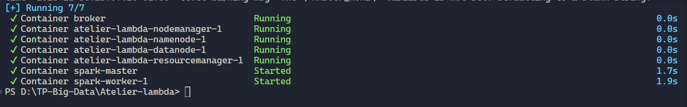

2. Vérifier les conteneurs :
    - Image : 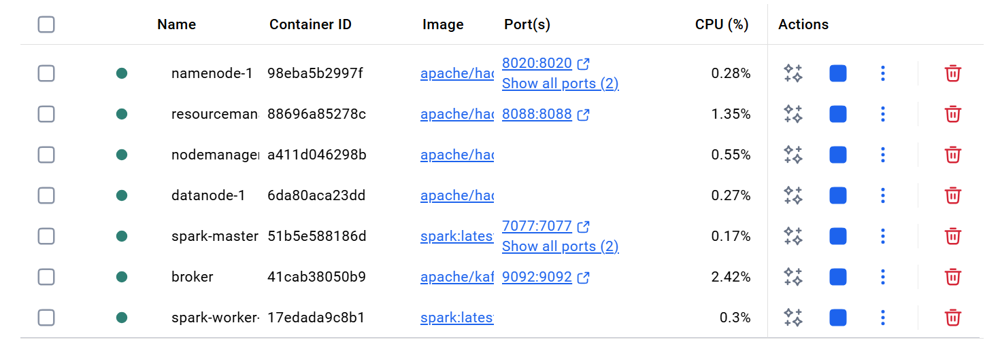
3. Ingestion (Kafka)
   - Création de topic, producer, format des messages.
    - Image : 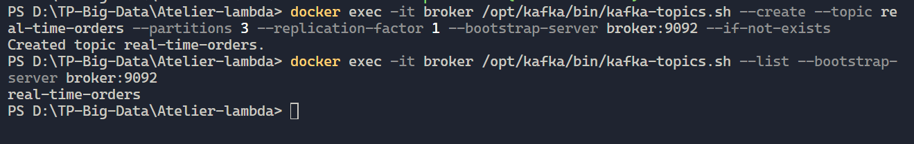
   - Image : 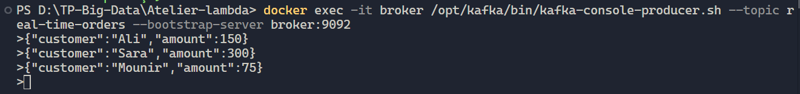
    - Image : 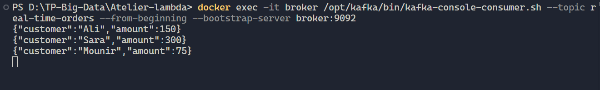

3. Speed layer (streaming_job.py)
   - Schéma, lecture Kafka, parsing JSON, agrégation en streaming.
   - Image : 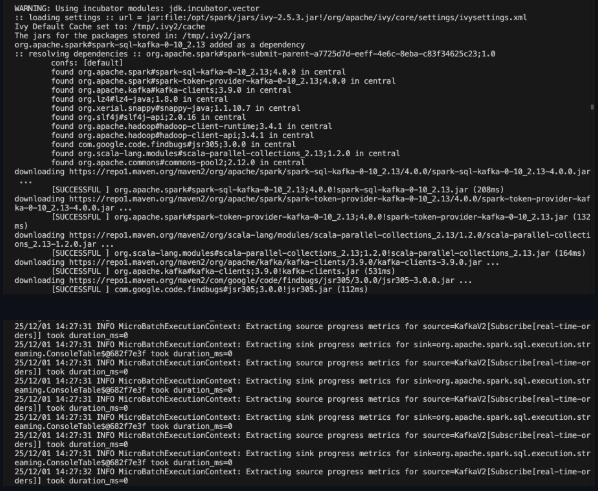

4. Batch layer (batch_job.py)
   - Traitement historique, écriture des résultats (ex: app/batch_output).
   - Image : 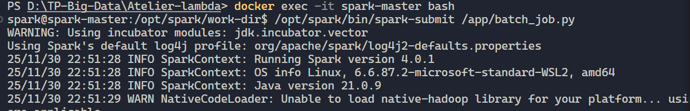
   - Image : 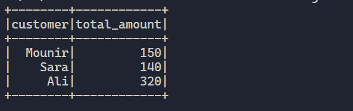

5. Serving layer (serving_layer.py)
   - Fusion Batch + Stream, exposition / simulation de l'API.
   - Image : 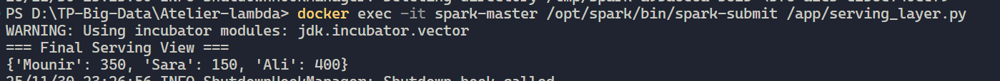

6. Exemples de sorties
   - JSON de sortie batch, capture console du streaming.
   - Image : 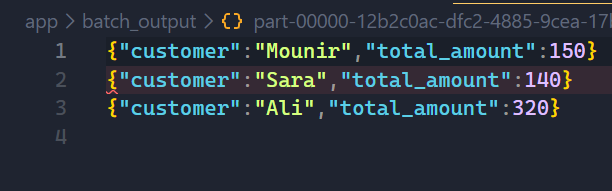
   - Image : 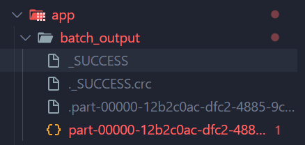 

